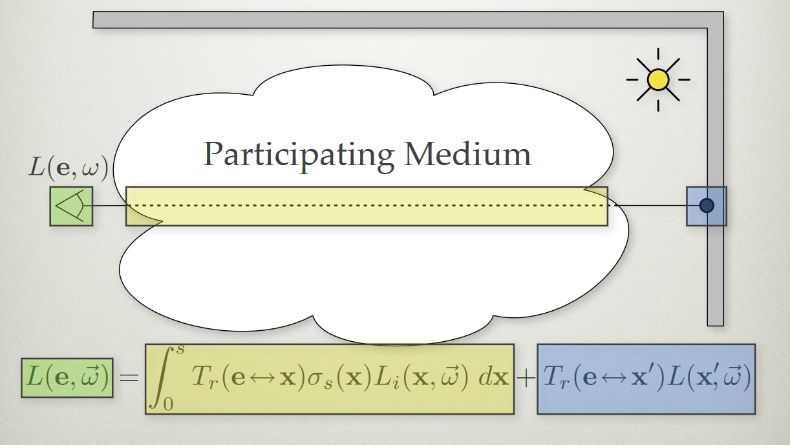
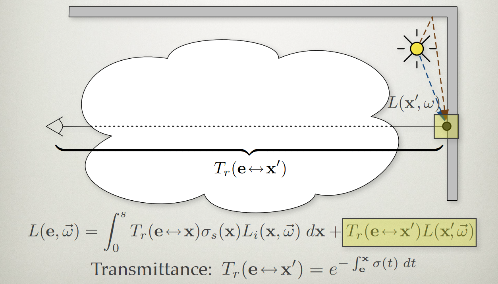
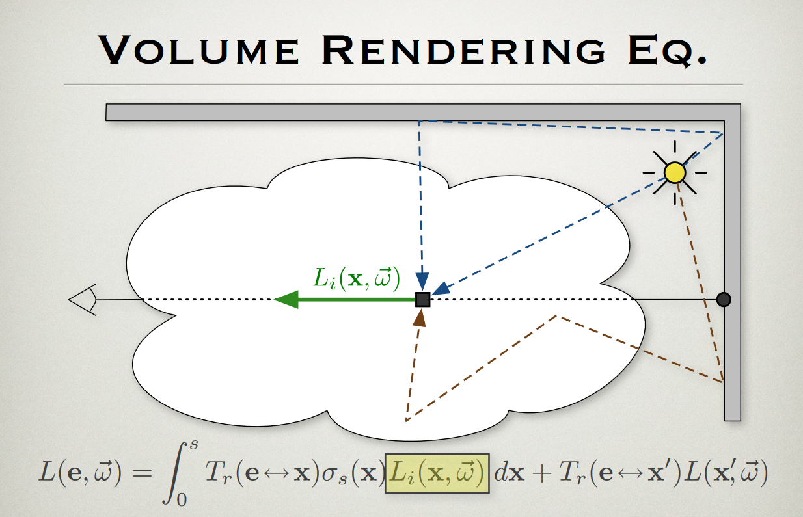
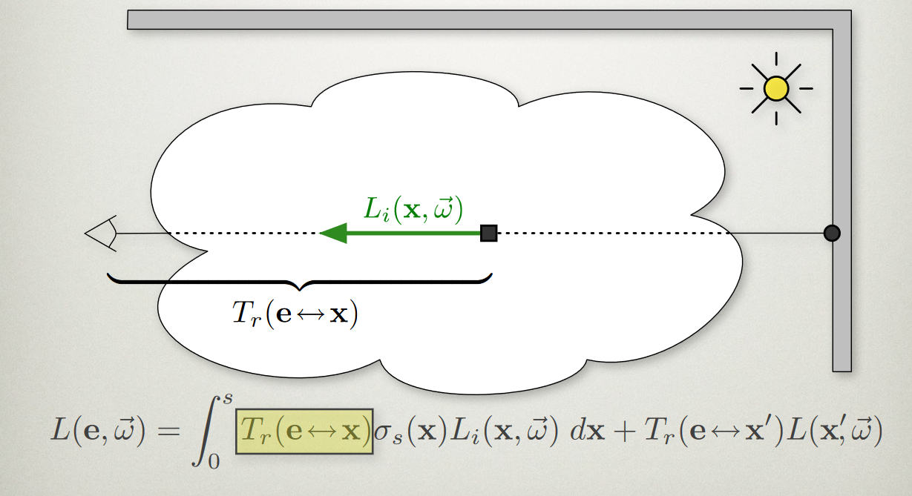
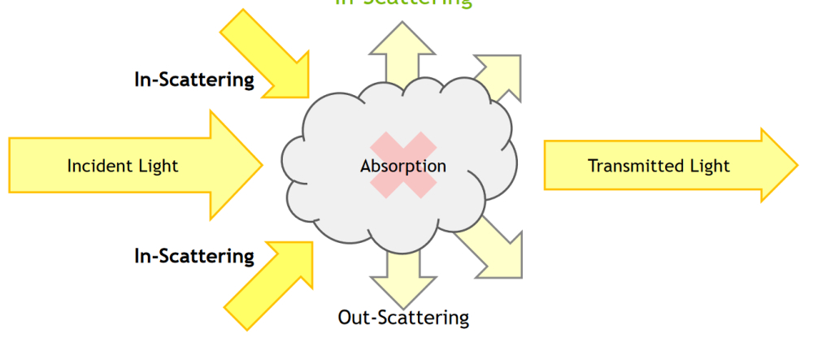
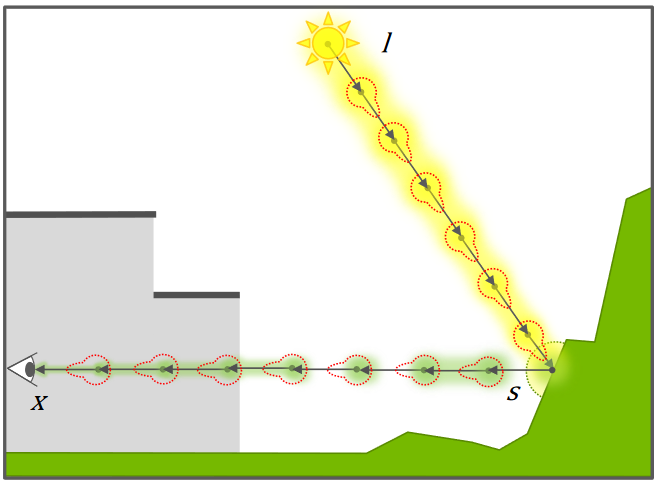

# Overview

 

Volume rendering is pretty simple. Hard part is making it fast.

The derivation of the prevelant volume rendering model is motivated by a simple starting point. Let's try construct it from first principles and consider a differential volume unit (imagine a volume split up into tiny little cubes) made up of a bunch of molecule particles. For this dV, what would contribute to light radiance $L_{o}$, in direction $\overrightarrow{w_{o}}$? What can happen to light as it interacts with the particles?

- **Nothing:** for a specific direction (opposite direction $-\overrightarrow{w_{o}}$ ), some percentage of incoming light $L_{i}$ won't collide at all and just pass through to $L_{o}$
- **Emission:** particles can emit light (like fire). Let's call this function $L_{e}\left(\boldsymbol{x} ,\boldsymbol{\vec{w}}_{o}\right)$ which gives us the amount of light a differential volume unit at $\boldsymbol{x}$ emits in direction $\boldsymbol{\vec{w}}_{o}$
- **Light-Particle Interaction:** for every direction around the differential volume unit, some percentage of light will hit collide with the particles
  - **Absorption:** some light will be absorbed
  - **Scattered:** some light will be scattered into the direction $L_{o}$

In math terms, we can write this as

$$
L_{o}( x,w_{o}) \ =\ T_{r}(\boldsymbol{x\mapsto x} `) L_{i}( x,-w_{o}) +L_{e}( x,w_{o}) +\int _{S^{2}} \sigma _{a}( x) \sigma _{s}( x) p( w,w_{o}) L_{i}( x,w) dw\\
where\ L_{i}( x,w) \Longrightarrow incoming\ light\ radiance\ at\ x\ from\ direction\ w\\
L_{o}( x,w) \Longrightarrow outgoing\ light\ radiance\ at\ x\ in\ direction\ w\\
T_{r}(\boldsymbol{x\mapsto x} `) \Longrightarrow transmittence\ factor\ of\ light\ that\ passes\ through\ from\ no\ collisions\\
L_{e}( x,w_{o}) \Longrightarrow light\ emitted\ by\ the\ volume\ at\ x\ in\ direction\ w_{o}\\
\sigma _{a}( x) \Longrightarrow attenuation\ factor\ of\ light\ from\ being\ absorbed\ at\ x\\
\sigma _{s}( x) \Longrightarrow attenuation\ factor\ of\ light\ from\ being\ scattered\ at\ x\\
p( w,w_{o}) \Longrightarrow percentage\ of\ light\ coming\ from\ direction\ w\ that\ scatters\ in\ direction\ w_{o}
$$

That's it. Like most things in rendering, the physics of it is simple (ofc just at this layer and this empirical model that's not reality based). You could write a brute force volume renderer that rivals the quality of Arnold or Octane in an hour or so, maybe a weekend if you're new to rendering. Now, it may take 6 days to render one frame but you're final output will be photoreal. Everything afterwards is how to make it fast.

So for the math, let's formulate everything in differential forms to inspire what some of these functions (e.g. $\sigma _{t}() ,\ \sigma _{a}()$) should be. And then we can solve the integrals to derive $L( x,w)$

$$
\begin{aligned}
\mathnormal{dL}(\boldsymbol{x} ,\ \boldsymbol{\vec{w}} ) & =\ \mathnormal{L}_{i}(\boldsymbol{x} ,\ \boldsymbol{\vec{w}} )\ -\ \mathnormal{L}_{o}(\boldsymbol{x} ,\ \boldsymbol{\vec{w}} )\\
 & =emission\ +\ scattering_{in} \ -\ scattering_{out} \ -\ absorption
\end{aligned}\\
\begin{aligned}
\boldsymbol{x\mapsto x} ' & \Longrightarrow \ Ray\ starting\ at\ point\ \boldsymbol{x} ,\ with\ direction\ \boldsymbol{\vec{w}_{\boldsymbol{x\mapsto x} '}} \ pointing\ towards\ \boldsymbol{x} '\\
\boldsymbol{\vec{w}}_{i}\mathbf{\mapsto }\boldsymbol{\vec{w}}_{o} & \Longrightarrow \ From\ direction\ \boldsymbol{\vec{w}}_{i} \ to\ \boldsymbol{\vec{w}}_{o}\\
L(\boldsymbol{x} ,\ \boldsymbol{\vec{w}}_{o} ) & \ \Longrightarrow \ Light\ radiance\ at\ point\ \boldsymbol{x} \ in\ direction\ \boldsymbol{\vec{w}}_{o}
\end{aligned}
$$

## Implementation Details: We are using several key assumptions

- Important! When we calculate transmittence during raymarch in $\Delta s$ steps, we assume several properties are constant across the ray segment
  - the $\sigma _{t}(\boldsymbol{x})$ extinction coefficient
  - density
  - incoming light to this sample
  - But that doesn't mean transmittence is constant. Instead, it should be $\int ^{\Delta s}_{0} e^{-\sigma _{t}(\boldsymbol{x}) s} ds\ =\frac{1-e^{-\sigma _{t}(\boldsymbol{x}) \Delta s}}{\sigma _{t}}$ incoming light to this sample
  - If density varies along path segment, we can just average it between the start and end: $\frac{1-e^{-0.5\left( \sigma _{t}\left(\boldsymbol{x}^{1}\right) +\sigma _{t}\left(\boldsymbol{x}^{1}\right)\right) \Delta s}}{\sigma _{t}}$
- The medium is a collection of microscopic particles where their size is >> size of light wavelength
- We assume particle positions are statistically independent so that we can multiply individual particle cross-sections by density to yield scattering coefficients
- We usually assume an *isotropic* medium aka the collision coefficients do not depend on the direction of light propagation and the phase function is only parameterized by angle between incoming light and scattered outgoing light. **NOTE:** The phase function itself can still be anisotropic
- **Nerd-out assumptions:** Also assuming elastic scattering where photon packet can only change direction (and not energy/wavelength) at scattering events. So we can't simulate flourescene/phosphorescence but allows us to simulate individual wavelengths of light independently of each other. What does this mean in practice in 2019 for realtime rendering? Nothing other than providing fodder for people who like to "Well actually..." derail conversation threads.

# Derivation of lambert-beer

<https://patapom.com/topics/Revision2013/Revision%202013%20-%20Real-time%20Volumetric%20Rendering%20Course%20Notes.pdf>

# Mean Free Path

# Implementation details: One little trick

- Removing the optically thin density assumption
  - Most papers assume optically thin density aka density across a short path segment is relatively small
  - Still assumes color field is constant across length of a short path segment

# Art Directability

## Contrast adjustment

\[Wrenninge 2013, Art-Directable Multiple Volumetric Scattering]

- Main idea is to reduce extinction coefficient $\sigma _{t}$ along shadow ray to let more light reach shaded point
- But instead of fixed scaling factor, use a summation over several scales
- Also adjust phase function and local scattering coefficient $\sigma _{s}$

$$
L=\sum ^{N-1}_{i=0} L_{i}
$$

$$
L_{i} =\sigma _{s} b^{i} L_{light} (\omega _{i} )p\left( \omega _{i} ,\omega _{o} ,c^{i} g\right) e^{-a^{i}\int ^{t}_{0} \sigma _{t} (s)ds}
$$

where

- N = Octaves
- a = attenuation
- b = contribution

Notes:

- Good defaults: N=8, a=b=c=1/2
- Can be used to fake multiple scattering

## Adjusting mean-free path

\[2011, Production Volume Rendering at Weta Digital]

Premise: each order of scattering can be computed separately or in discrete groups rather than to be considered as either single scattering or multiple scat- tering. Moreover the multiple scattering studies done in \[Bou08] show that higher orders of scattering display a behavior similar to that of single scattering

- Lengthen mean-free path and make the phase function more isotropic for each higher order bounce
- Can also blur the deep shadow map
  asdf

## Higher order approximations of multiple scattering

<http://evasion.imag.fr/~Antoine.Bouthors/research/phd/>
