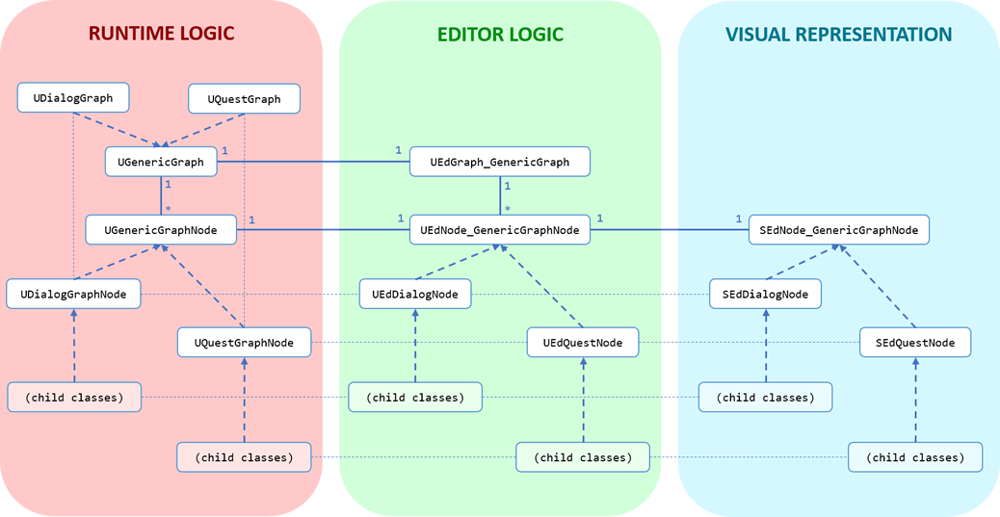
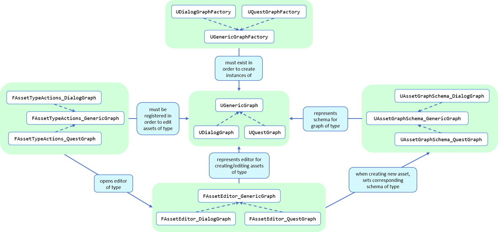

# Class Diagram Overview

There's on overabundance of class/OOP and hard to track what is supposed to do what. Here's a great diagram from <http://www.ms.mff.cuni.cz/~polakma1/adventure-plugin/programming.html> that crystalizes the relationships.

From a UI/MVC viewpoint:


From a functionality/responsibility viewpoint:


# How to Make Tools Tutorial

This is from [Eric Zhang (@lxjk)](https://github.com/lxjk) excellent guide [How to Make Tools in UE4](https://lxjk.github.io/2019/10/01/How-to-Make-Tools-in-U-E.html)

Next we are going to add a custom menu, so we can add widget in the menu to run a command or open up a window.

First we need to add menu extensions related functions in our editor module **ToolExampleEditor**:

ToolExampleEditor.h

```cpp
    public:
        void AddMenuExtension(const FMenuExtensionDelegate &extensionDelegate, FName extensionHook, const TSharedPtr &CommandList = NULL, EExtensionHook::Position position = EExtensionHook::Before);
        TSharedRef GetMenuRoot() { return MenuRoot; };

    protected:
        TSharedPtr LevelEditorMenuExtensibilityManager;
        TSharedPtr MenuExtender;

        static TSharedRef MenuRoot;

        void MakePulldownMenu(FMenuBarBuilder &menuBuilder);
        void FillPulldownMenu(FMenuBuilder &menuBuilder);
```

In the cpp file, define **MenuRoot** and add the implement all the functions. Here we will add a menu called "Example" and create 2 sections: "Section 1" and "Section 2", with extension hook name "Section_1" and "Section_2".

ToolExampleEditor.cpp


    TSharedRef FToolExampleEditor::MenuRoot = FWorkspaceItem::NewGroup(FText::FromString("Menu Root"));


    void FToolExampleEditor::AddMenuExtension(const FMenuExtensionDelegate &extensionDelegate, FName extensionHook, const TSharedPtr &CommandList, EExtensionHook::Position position)
    {
        MenuExtender->AddMenuExtension(extensionHook, position, CommandList, extensionDelegate);
    }

    void FToolExampleEditor::MakePulldownMenu(FMenuBarBuilder &menuBuilder)
    {
        menuBuilder.AddPullDownMenu(
            FText::FromString("Example"),
            FText::FromString("Open the Example menu"),
            FNewMenuDelegate::CreateRaw(this, &FToolExampleEditor::FillPulldownMenu),
            "Example",
            FName(TEXT("ExampleMenu"))
        );
    }

    void FToolExampleEditor::FillPulldownMenu(FMenuBuilder &menuBuilder)
    {
        // just a frame for tools to fill in
        menuBuilder.BeginSection("ExampleSection", FText::FromString("Section 1"));
        menuBuilder.AddMenuSeparator(FName("Section_1"));
        menuBuilder.EndSection();

        menuBuilder.BeginSection("ExampleSection", FText::FromString("Section 2"));
        menuBuilder.AddMenuSeparator(FName("Section_2"));
        menuBuilder.EndSection();
    }

Finally in **StartupModule** we add the following before we call the parent function. We add our menu after "Window" menu.

ToolExampleEditor.cpp


    void FToolExampleEditor::StartupModule()
    {
        if (!IsRunningCommandlet())
        {
            FLevelEditorModule& LevelEditorModule = FModuleManager::LoadModuleChecked("LevelEditor");
            LevelEditorMenuExtensibilityManager = LevelEditorModule.GetMenuExtensibilityManager();
            MenuExtender = MakeShareable(new FExtender);
            MenuExtender->AddMenuBarExtension("Window", EExtensionHook::After, NULL, FMenuBarExtensionDelegate::CreateRaw(this, &FToolExampleEditor::MakePulldownMenu));
            LevelEditorMenuExtensibilityManager->AddExtender(MenuExtender);
        }
        IExampleModuleInterface::StartupModule();
    }

Now if you run it you should see the custom menu get added with two sections.

![002.png][1]

Next we can add our first tool to register to our menu. First add two new files:

![003.png][2]

This class will inherit from **IExampleModuleListenerInterface**, and we add function to create menu entry. We also add **FUICommandList**, which will define and map a menu item to a function. Finally we add our only menu function **MenuCommand1**, this function will be called when user click on the menu item.

MenuTool.h


    #include "ToolExampleEditor/IExampleModuleInterface.h"

    class MenuTool : public IExampleModuleListenerInterface, public TSharedFromThis
    {
    public:
        virtual ~MenuTool() {}

        virtual void OnStartupModule() override;
        virtual void OnShutdownModule() override;

        void MakeMenuEntry(FMenuBuilder &menuBuilder);

    protected:
        TSharedPtr CommandList;

        void MapCommands();

        // UI Command functions
        void MenuCommand1();
    };

On the cpp side, we got a lot more to do. First we need to define **LOCTEXT_NAMESPACE** at the beginning, and un-define it at the end. This is required to use **UI_COMMAND** macro. Then we start filling in each command, first create a **FUICommandInfo** member for each command in command list class, fill in **RegisterCommands** function by using **UI_COMMAND** marcro. Then in **MapCommands** function map each command info to a function. And of course define the command function **MenuTool::MenuCommand1**.

In **OnStartupModule**, we create command list, register it, map it, then register to menu extension. In this case we want our item in "Section 1", and **MakeMenuEntry** will be called when Unreal build the menu, in which we simply add **MenuCommand1** to the menu.

In **OnShutdownModule**, we need to unregister command list.

MenuTool.cpp


    #include "ToolExampleEditor/ToolExampleEditor.h"
    #include "MenuTool.h"

    #define LOCTEXT_NAMESPACE "MenuTool"

    class MenuToolCommands : public TCommands
    {
    public:

        MenuToolCommands()
            : TCommands(
            TEXT("MenuTool"), // Context name for fast lookup
            FText::FromString("Example Menu tool"), // Context name for displaying
            NAME_None,   // No parent context
            FEditorStyle::GetStyleSetName() // Icon Style Set
            )
        {
        }

        virtual void RegisterCommands() override
        {
            UI_COMMAND(MenuCommand1, "Menu Command 1", "Test Menu Command 1.", EUserInterfaceActionType::Button, FInputGesture());

        }

    public:
        TSharedPtr MenuCommand1;
    };

    void MenuTool::MapCommands()
    {
        const auto& Commands = MenuToolCommands::Get();

        CommandList->MapAction(
            Commands.MenuCommand1,
            FExecuteAction::CreateSP(this, &MenuTool::MenuCommand1),
            FCanExecuteAction());
    }

    void MenuTool::OnStartupModule()
    {
        CommandList = MakeShareable(new FUICommandList);
        MenuToolCommands::Register();
        MapAction();
        FToolExampleEditor::Get().AddMenuExtension(
            FMenuExtensionDelegate::CreateRaw(this, &MenuTool::MakeMenuEntry),
            FName("Section_1"),
            CommandList);
    }

    void MenuTool::OnShutdownModule()
    {
        MenuToolCommands::Unregister();
    }

    void MenuTool::MakeMenuEntry(FMenuBuilder &menuBuilder)
    {
        menuBuilder.AddMenuEntry(MenuToolCommands::Get().MenuCommand1);
    }

    void MenuTool::MenuCommand1()
    {
        UE_LOG(LogClass, Log, TEXT("clicked MenuCommand1"));
    }

    #undef LOCTEXT_NAMESPACE

When this is all done, remember to add this tool as a listener to editor module in **FToolExampleEditor::AddModuleListeners**:

ToolExampleEditor.cpp


    ModuleListeners.Add(MakeShareable(new MenuTool));

Now if you build the project, you should see your menu item in the menu. And if you click on it, it will print "clicked MenuCommand1".

By now you have a basic framework for tools, You can run anything you want based on a menu click.

![004.png][3]

[1]: https://github.com/lxjk/lxjk.github.io/raw/master/images/ue4tools/002.png
[2]: https://github.com/lxjk/lxjk.github.io/raw/master/images/ue4tools/003.png
[3]: https://github.com/lxjk/lxjk.github.io/raw/master/images/ue4tools/004.png
