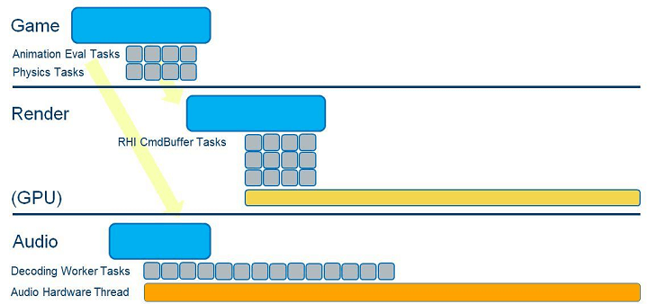

# Thread Pools

- STAT_FrameSyncTime => GT waiting on RT

- TaskGraph:
  - TaskGraphThreadBP
    - TPri_Lowest
  - TaskGraphThreadNP
    - TPri_BelowNormal: 8 (FPlatformMisc::NumberOfCores())
  - TaskGraphThreadHP
    - TPri_SlightlyBelowNormal

- StatsThread:

- FQueuedThreadPool:
  - GThreadPool:
    - TPri_SlightlyBelowNormal: 14
  - GBackgroundPriorityThreadPool:
    - TPri_Lowest: 2
  - GLargeThreadPool: (Editor Only for building lighting etc)
    - TPri_Normal: 14
  - GIOThreadPool: FPlatformMisc::NumberOfIOWorkerThreadsToSpawn()

- GImgMediaThreadPoolSlow
  - FQueuedThreadPool::Allocate();

# Details

# Game Thread

*Reference From <https://software.intel.com/en-us/articles/intel-software-engineers-assist-with-unreal-engine-419-optimizations>*

- Game thread runs ahead of everything else

- Render thread is one frame behind the game thread.

  - There's sometimes a separate RHIThread (on D3D12) that just submits to the driver

- Whatever is displayed thus runs two frames behind.

- Tick Groups: control order of ticking of objects but is not parallel

## Render Thread

Render thread handles generating render commands to send to the GPU.

Each frame is broken down into phases that are done one after another. Within each phase, the render thread can go wide to generate the command lists for that phase:

- Depth prepass

- Base pass

- Translucency

- Velocity

Breaking the frame into chunks enables farming them into worker tasks with a parallel command list that can be filled up with the results of those tasks.

Those get serialized back and used to generate draw calls.

Engine doesn’t join worker threads at the call site, but instead joins at sync points (end of phases), or at the point where they are used if fast enough.

## Audio Thread

The main audio thread is analogous to the render thread, and acts as the interface for the lower-level mixing functions by performing the following tasks:

- Evaluating sound queue graphs

- Building wave instances

- Handling attenuation, and so on

The **audio thread is** the thread that all user-exposed APIs (such as Blueprints and Gameplay) interact with. The decoding and source-worker tasks decode the audio information, and also perform processing such as spatialization and head-related transfer function (HRTF) unpacking. (HRTF is vital for players in VR, as the algorithms allow users to detect differences in sound location and distance.)

The **audio hardware thread** is a single platform-dependent thread (for example, XAudio2\* on Microsoft Windows\*), which renders directly to the output hardware and consumes the mix. This isn’t created or managed by Unreal Engine, but the optimization work will still impact thread usage.

two types of tasks—decoding and source worker.

- Decoding: decodes a block of compressed source files. Uses double buffering to decode compressed audio as it's being played back.

- Source Worker: performs the actual source processing for sources, including sample rate conversion, spatialization (HRTF), and effects. The Source Worker is a configurable number in an INI file.

  - If you have four workers and 32 sources, each will mix eight sources.

  - The Source Worker is highly parallelizable, so you can increase the number if you have more processor power.
