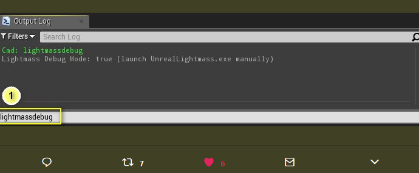
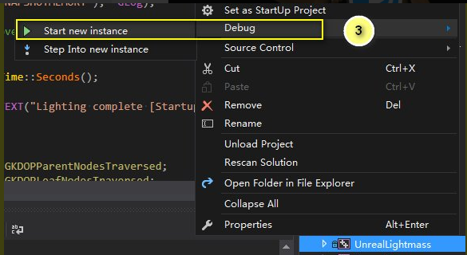

Manually launching lightmass steps (allows placing breakpoints in lightmass, stepping through, etc)

- Have a visual studio open to the UE4 solution, build lightmass in debug win64, set as startup project

- Launch editor, enter the console command 'lightmassdebug'

- Start a lighting build, watch the swarm log window until it says something like waiting for connection

- Launch lightmass in debug, should complete the lighting build, and UE4 should import the results when it completes

Texel debugging steps

- define ALLOW_LIGHTMAP_SAMPLE_DEBUGGING to 1 in both places

- Disable lightmap compression with bCompressLightmaps=False in baselightmass.ini

- Build lighting once with that in a map with static meshes

- Hold T and select a texel on one of the built static meshes

- Now launch lightmass manually as above, you should be able to hit breakpoints at the various 'bDebugThisTexel = true;' lines in lightmass

*Reference From <https://udn.unrealengine.com/questions/171210/view.html>*

Debug lightmass:

1. Lightmassdebug command

2. Build Lighting Only

3. Launch Lightmass from visual studio manually in debug

