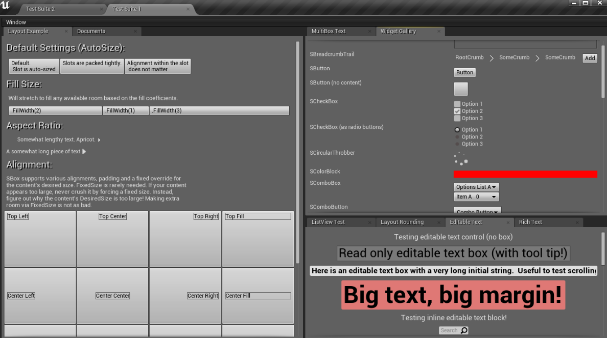

### Widget Gallery/Slate Test Suite:

Go to Window -> Developer Tools -> Debug Tools -> Test Suite. Shows all the different widgets



### Writing Custom Slate Widgets:

**UWidgetBlueprintLibrary** & **UWiddgetLayoutLibrary**, & **USlateBlueprintLibrary** great reference for looking at slate drawing functions & helpers

- Ends up calling FSlateDrawElement::MakeBox or FSlateDrawElement::MakeLine

### Slate Examples:

Console command "testprops" will bring up UPropertyEditorTestObject that contains all base properties and the corresponding slate widgets

- testprops tree

- testprops table

More slate samples: SWidgetGallery.h & AppFramework/STestSuite/SWizard/STableViewTesting/SLayoutExample

### Slate ListView Example:

- SModuleUI is a great simple listview example with text search and multicolumns

- SCollisionAnalyzer shows how to implement sorting

### Custom Array Properties

- Simple example

  ```cpp
  IDetailCategoryBuilder& NodeCategory = DetailBuilder.EditCategory("Node");
  TSharedRef<FDetailArrayBuilder> NodeArrayBuilder = MakeShareable(new FDetailArrayBuilder(NodesPropertyHandle.ToSharedRef()));
  NodeArrayBuilder->OnGenerateArrayElementWidget(FOnGenerateArrayElementWidget::CreateSP(this, &FRigDetails::GenerateNodeArrayElementWidget, &DetailBuilder));

  NodeCategory.AddCustomBuilder( NodeArrayBuilder, false );
  ```

- Complex example is `FNiagaraDetailSourcedArrayBuilder`

### Working with IPropertyHandle & DetailChildrenBuilder

- Getting a child IPropertyHandle

  ```cpp
  TSharedPtr<IPropertyHandle> VariantTypePropHndle = StructPropertyHandle->GetChildHandle(GET_MEMBER_NAME_CHECKED(TInSumType, VariantType));
  ```

- Adding said property

  ```cpp
  ChildBuilder.AddProperty(VariantTypePropHndle.ToSharedRef());
  ```

- Adding property with SProperty Widget

  ```cpp
  SNew( SProperty, DetailBuilder.GetProperty(GET_MEMBER_NAME_CHECKED(ABBStadiumRig, bDbgShowRootVis)))
  ```

- Getting Detail View from `IDetailChildrenBuilder`

  ```cpp
  TSharedRef<const SWidget> DetailsView = ChildBuilder.GetParentCategory().GetParentLayout().GetDetailsView()->AsShared();
  ```

### Make Enum Combobox

- Post 4.24: SEnumCombobox is a widget you can use. Pre 4.24: Use this:

  ```cpp
  MovieSceneToolHelpers::MakeEnumComboBox(
    StaticEnum<TVariantEnum>(),
    MakeAttributeLambda([VariantTypePropHndle] {
        uint8 enumVal = 0;
        if (VariantTypePropHndle.IsValid() && VariantTypePropHndle->IsValidHandle())
        {
            VariantTypePropHndle->GetValue(enumVal);
        }
        return (int32)enumVal;
    }),
    FOnEnumSelectionChanged::CreateLambda([VariantTypePropHndle](int32 Selection, ESelectInfo::Type SelectionType) {
        if (VariantTypePropHndle.IsValid() && VariantTypePropHndle->IsValidHandle())
        {
            VariantTypePropHndle->SetValue((uint8)Selection);
        }
    })
  )
  ```

### Menu Builder & Pulldown Menu & Submenu:

```cpp
FMenuBarBuilder MenuBarBuilder( CommandList );
{
MenuBarBuilder.AddPullDownMenu( TEXT("Menu 1"), TEXT("Opens Menu 1"), FNewMenuDelegate::CreateRaw( &FMenus::FillMenu1Entries ) );

MenuBarBuilder.AddPullDownMenu( TEXT("Menu 2"), TEXT("Opens Menu 2"), FNewMenuDelegate::CreateRaw( &FMenus::FillMenu2Entries ) );
}

return MenuBarBuilder.MakeWidget();

static void FillMenu1Entries( FMenuBuilder& MenuBuilder )

{

MenuBuilder.AddEditableText( TEXT( "Editable Item" ), TEXT( "You can edit this item's text" ), NAME_None, TEXT( "Edit Me!" ) );

MenuBuilder.AddMenuEntry( FMultiBoxTestCommandList::Get().EighthCommandInfo );

MenuBuilder.AddMenuSeparator();

MenuBuilder.AddSubMenu( TEXT("Sub Menu"), TEXT("Opens a submenu"), FNewMenuDelegate::CreateRaw( &FMenus::FillSubMenuEntries ) );

MenuBuilder.AddWidget(SNew(SVolumeControl), TEXT("Volume"));

}
```

*Reference From <https://docs.unrealengine.com/latest/INT/Programming/Slate/Widgets/index.html>*

### Drop down pulldown/combo toolbar button:

```cpp
GameToolBarBuilder.AddComboButton(
SpecialPIEOptionsMenuAction,
FOnGetContent::CreateRaw( &FLevelEditorToolBar::GeneratePIEMenuContent, InCommandList ),
FText(),
LOCTEXT("PIEComboToolTip", "Play-In-Editor options") );
```

*Reference From <https://docs.unrealengine.com/latest/INT/Programming/Slate/Widgets/index.html>*

### Create Property Table:

```cpp
// TableView

const TSharedRef&lt; IPropertyTable &gt; Table = Module.CreatePropertyTable();

TArray< UObject* > Objects;

for (int Count = 0; Count < 50; Count++)

{

Objects.Add(NewObject<UPropertyEditorTestObject>());

}

Table->SetObjects( Objects );

for (TFieldIterator<UProperty> PropertyIter( UPropertyEditorTestObject::StaticClass(), EFieldIteratorFlags::IncludeSuper); PropertyIter; ++PropertyIter)

{

const TWeakObjectPtr< UProperty >& Property = *PropertyIter;

Table->;AddColumn( Property );

}

Window->SetContent

(

SNew(SBorder)

.BorderImage(FEditorStyle::GetBrush("ToolPanel.GroupBorder"))

[

Module.CreatePropertyTableWidget( Table )

]

);
```

**Custom Complex Widget UI:** <https://github.com/ue4plugins/ObjectBrowser>

**Focus keyboard window to specific widget:**

```cpp
FWidgetPath WidgetPath;

 bool bFound = FSlateApplication::Get().FindPathToWidget(DetailsView, WidgetPath);

 if (bFound)

 {

 FSlateApplication::Get().SetAllUserFocus(WidgetPath, EFocusCause::SetDirectly);

 }
```

#### Asset Picker:

```cpp
FAssetPickerConfig **AssetPickerConfig**;
        **AssetPickerConfig**.OnAssetDoubleClicked = FOnAssetDoubleClicked::CreateStatic(&SBlutilityShelf::OnBlutilityDoubleClicked);
        **AssetPickerConfig**.OnGetAssetContextMenu = FOnGetAssetContextMenu::CreateSP(this, &SBlutilityShelf::OnBlutilityGetContextMenu);
        **AssetPickerConfig**.InitialAssetViewType = EAssetViewType::Tile;
        **AssetPickerConfig**.bAllowNullSelection = false;
        **AssetPickerConfig**.bShowBottomToolbar = false;
        **AssetPickerConfig**.bAutohideSearchBar = bInFavoritesMode ? true : false;

**AssetPickerConfig**.Filter.ClassNames.Add(UEditorUtilityBlueprint::StaticClass()->GetFName());
        if (bInFavoritesMode)
        {
                new (**AssetPickerConfig**.Collections) FCollectionNameType(BlutilityModule::**BlutilityShelfCollectionName**, ECollectionShareType::CST_Local);
        }

ChildSlot
        \[
                SNew(SVerticalBox)
                +SVerticalBox::Slot()
                .FillHeight(1.0f)
                \[
                        **ContentBrowserModule**.Get().CreateAssetPicker(**AssetPickerConfig**)
                \]
        \];
```

#### Class Picker/Class Viewer

```cpp
const bool bPressedOk = SClassPickerDialog::PickClass(TitleText, Options, ChosenClass, UDataAsset::StaticClass());

FClassViewerModule& ClassViewerModule = FModuleManager::LoadModuleChecked<FClassViewerModule>;("ClassViewer");

TSharedRef<SWidget> ClassViewer = ClassViewerModule.CreateClassViewer(Options, FOnClassPicked::CreateRaw(this, &FBBProcSeqCapObjEditorBinding::HandleProcSeqContextClassPicked));

Create Dynamic Context Menu:

FLevelEditorModule& **LevelEditorModule** = FModuleManager::GetModuleChecked<FLevelEditorModule>( "LevelEditor");
        TSharedPtr< ILevelEditor > **LevelEditor** = **LevelEditorModule**.GetFirstLevelEditor();

TSharedPtr<SWidget> **MenuWidget**;

if (**ComponentsWithSockets**.Num() > 1)
        {                        
                **MenuWidget** = 
                        SNew(SComponentChooserPopup)
                        .Actor(**ParentActor**)
                        .**OnComponentChosen**(this, &FActorPickerTrackEditor::ActorComponentPicked, **ParentActor**, **ObjectGuid**, **Section**);

// Create as context menu
                FSlateApplication::Get().PushMenu(
                        **LevelEditor**.ToSharedRef(),
                        FWidgetPath(),
                        **MenuWidget**.ToSharedRef(),
                        FSlateApplication::Get().GetCursorPos(),
                        FPopupTransitionEffect( FPopupTransitionEffect::ContextMenu )
                        );
        }
```
