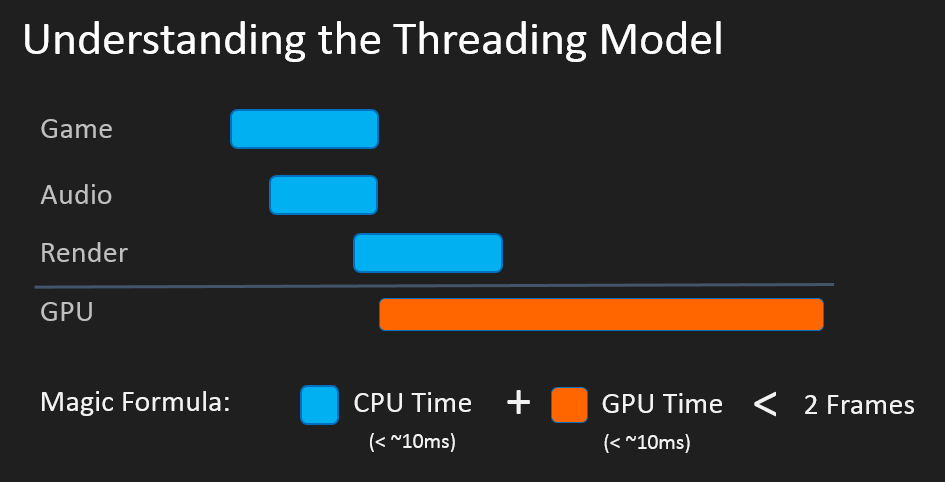
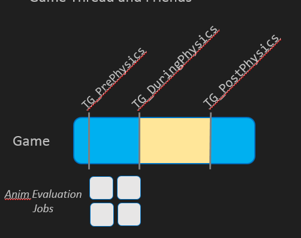
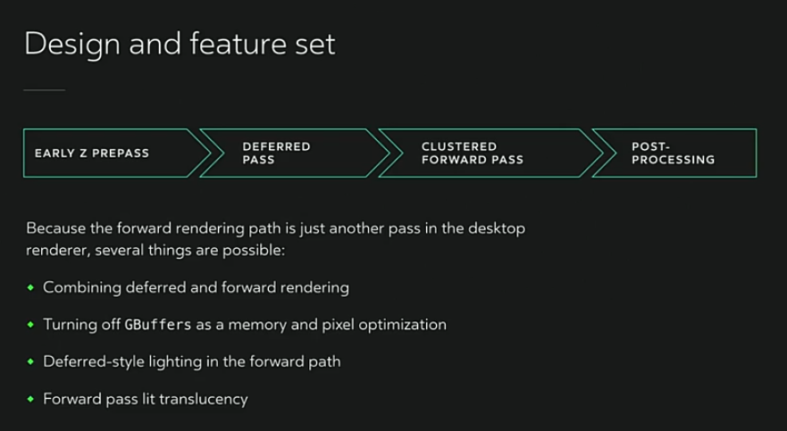

<https://forums.unrealengine.com/development-discussion/vr-ar-development/1371458-make-maintain-framerate-technical-postmortem-for-robo-recall-and-beyond-by-nick-whiting>



# Ticking is not multithreaded

- The Game Thread handles updates for gameplay, animation, physics, networking, etc., and most importantly, Actor ticking.


- TickGroups control Tick order but do not give parallelism


- Physics use tasks within the game thread to perform their work


- AnimGraphs can do parallel evaluation


- **Trick:** Can hide some of your tick work by moving Actors to TG_DuringPhysics, shortening your overall Game thread time

- **Rule Of Thumb: Move things that don’t affect velocity or position of Actors, or generate overlap events into TG_DuringPhysics.**

A few of the heavier classes that we moved to TG_DuringPhysics in Robo Recall are:

OdinAIManager

OdinSpeechManager

OdinWaveSpawner

OdinPhysicalAudioComponent

OdinGameMode

OdinScoreManager

OdinPopulationManager



# Render Thread:

- Handles command list generation

- At top of thread, calculate final hmd pose

- Then traverse scene and do parallel command generation

# Audio Thread:

- The main audio thread is analogous to the Render Thread, and interfaces the game thread with the lower level mixing threads.

- The decoding and source worker tasks decode the audio information, and also do processing like spatialization and HRTF.

- The audio hardware thread is a platform dependent thread (e.g. XAudio2 on Windows), which consumes the mix.

# Debug HMD Performance:

\-emulatestereo

r.setres 2160x1200

r.screenpercentage 140

'pause' - pauses game thread and then use 'show' command to profile rendering

Use stat physics & stat anim

Forward Renderer



Can do 70%-90% scale down with MSAA 2x/4x

MSAA + subpixel geometry = bad juju

Specular aliasing is an issue

Give BP compiler hints on inlining functions. Look at KismetMathLibrary.h for details:

```cpp
// Conditionally inlined

#if KISMET_MATH_INLINE_ENABLED

#include "KismetMathLibrary.inl"

#endif
```

Game Thread Optimization:

- Reduce # ticking actors

- Reduce # colliders

- Hide work in TG_DuringPhysics

- Check number of components in scene
